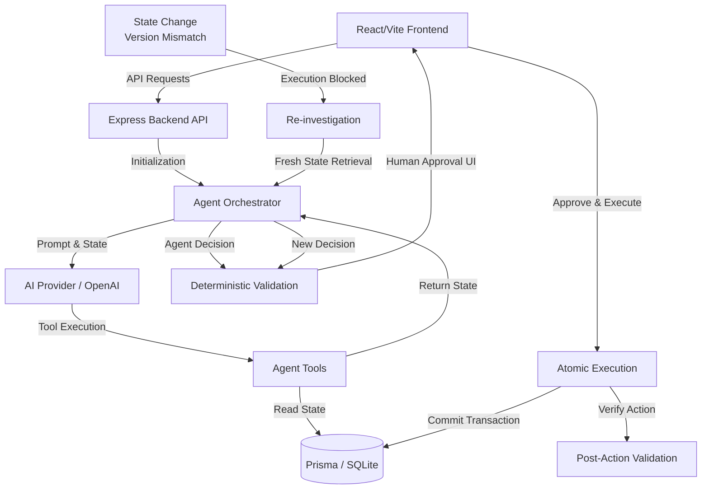

# Architecture

## Failure Recovery Workflow (Scenario 3 & 4)
When a user approves an inherently delayed action (e.g. human intervention), the environment state might have evolved:
1. **State Change**: e.g., budget is drastically reduced via an external action before execution completes.
2. **Version Mismatch**: The backend `validatePurchaseAction` / execution block verifies the cached `stateVersion` (Budget / Forecast) attached to the Agent's original recommendation.
3. **Execution Blocked**: The atomic execution rejects the proposed transaction because the bounds have shifted.
4. **Re-investigation**: The system forces the agent to rerun the decision loop using fresh, un-cached data.
5. **New Decision**: The Agent outputs a revised decision (such as `ESCALATE`) reflecting the new reality, without compromising business rules.
